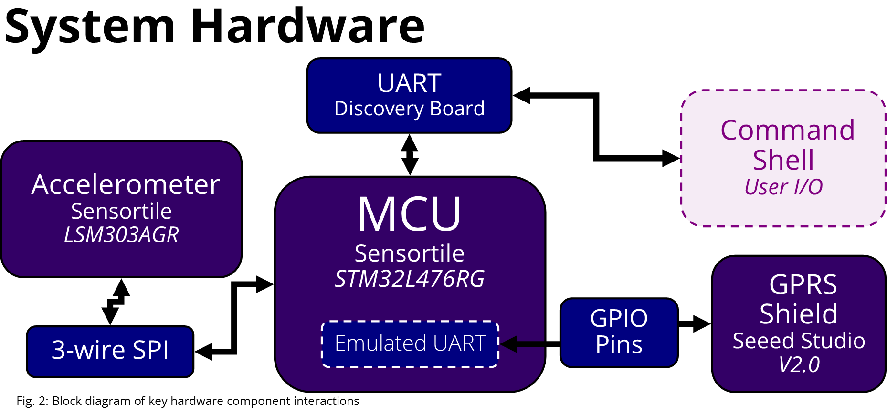

# TrailCounter

Embedded Trail Counter Utilizing Accelerometer, Gyro, and Cell Modem. Requires ChibiOS Directory at root.

**Thank you to my wonderful partner on this project, Maggie Oates. Good luck with your PHD!**  

### Introduction

Public and private trail systems can benefit from having hiker data to help manage land conservation, prioritize resource allocation, and predict maintanence needs. Our team decided to build a sensortile designed to be mounted on footbridges to count passersby using bridge vibrations that could communicate and store timestamp/people count info on a designated server via a cell modem. Unlike other sensortiles, our setup would alleviate the need for park rangers/administrators to manually retrieve data from the board.

In order to setup our board, we required the sensortile, the sensortile carrier, the STM32 board, the SIM900 cell modem, and a GSM SIM card. We chose to use The People's Operator. However, our setup would theoretically work with any GSM SIM.

For our server, we set up a python TCP server on silo. The server runs indefinitely on silo and waits for a connection from our sensortile. Though our server was left unsecured for the purpose of the demo, it would be secured for the purpose of actual deployment.

### Background
While there are many pedestrian counters on the market, most are designed for large pedestrian bridges. Of those that are appropriate for trails, many do not account for aesthetic concerns that match the natural environment.

There are a few counters that fit the use-case of small parks, especially Eco-Counter's infrared-based [PYRO sensor](http://www.eco-compteur.com/en/products/pyro-range/pyro-sensor) or [recycled post sensor](http://www.eco-compteur.com/en/products/pyro-range/recycled-post). Our counter differs in that it will be (1) appropriate for hidden mounting under bridges and (2) using vibration rather than beam-based counters. Its strengths will be as a low-cost, easy-setup, and easy-to-use while its weaknesses will lie in its low-accuracy and low-resolution data.

Our choice of using a TCP server that saves the timestamps/people count to a csv file was based on the ease of implementation + the ease of access. Another possible option would have been to create a web server with an html front or use the google sheets API to send our data straight to google sheets. However, the implementation of either of these options would have been far more difficult. Given the time we had, we opted for using the TCP server.

### Features

* Able to count pedestrian counts using bridge vibrations via accelerometer/gyro
* Stores a timestamped count each minute to the system RAM
* Utilizes a software uart to communicate between the sensortile and the modem, leaving the hw uart available for debugging and configuration
* Uploads the data via cell data at a configurable frequency to a remote TCP socket server
* Powered by any 5V power source

### Block Diagram

### Theory of Operation

We will go over the implementation of each of the features here followed by other notes and steps to take note of:

* **Able to count pedestrian counts using bridge vibrations via accelerometer/gyro**

The accelerometer/gyro is set up via the LSM303AGR_ACC_driver. Due to the nature of the sensortile, we had to set up the LSM303AGR using 3-wire SPI mode. This initialization and the other Accelerometer/Gyro functions may be found in /BSP/Common/lsm303agr/LSM303AGR_ACC_driver.c and LSM303AGR_ACC_driver.h. In order to get the acceleration from the accelerometer, we use the function LSM303AGR-ACC_Get_acceleration. This puts the x, y, and z-axis accelerometer reading in a data buffer.  We then use this data to figure out whether a person is walking across the bridge.

In order to figure out whether the acceleration readings indicate a person walking across the bridge, we take an acceleration reading when the board is first placed in its sensing location. Then while it is still, we set the current x, y, and z-axis as a the base acceleration. Then when a person crosses the bridge we take the new readings minus the base readings and check whether the reading is greater than a minimum threshold. For the purposes of our test, we set the minimum threshold to 500 mG. However, this threshold will have to be calibrated to the area to be tested. If the reading is in fact greater than the threshold, we increment a count of the number of people to have crossed the bridge and put the thresholding-checking thread to sleep for a configurable amount of time (currently 1 second).

* **Stores a timestamped count each minute to the system RAM**

Once per minute (configurable via the counter_config.h file), a timestamping thread runs and sets the time on the board to the current time via RTCDateTime as backup in case the board fails/resets. It then proceeds to check if the number of people counts that minute was greater than 0. If not, it increments a counter of the number of 0 counts to be recorded. If this count is greater than a preset recalibration frequency or a second count of continual detections is greater than the recalibration frequency, the sensortile will get the current acceleration and recalibrate the base readings.

If the people count is greater than 0, the board will store the current time and the people count in an array of a custom struct that contains the RTCDateTime and the count. This is stored in the system RAM. It will then set the count back to 0 and increment a count of the number of timestamps. The thread will then proceed to sleep for a set time (1 minute if you want a timestamp every minute).

* **Utilizes a software uart to communicate between the sensortile and the modem, leaving the hw uart available for debugging and configuration**

We chose to implement an emulated (software) UART because we wanted to leave the sensortile HW UART available for debugging and configuration via a ChibiOS Command Shell. In order to communicate between the sensortile and the GPRS Shield (modem), wrote an emulated UART that makes use of 2 arbitrary GPIO Pins that "act" like UART RX and TX pins. 

In order to do this, we first had to re-solder the sensortile cradle to allow for GPIO access. To make code more portable for future use, we defined a struct, EUARTHandle, that would hold necessary configuration variables, such as the baud rate and locations of TX/RX buffers. Having such a handles means that we could easily add another EUART or make our implementation more efficient without breaking existing code. The EUART's functionality centers around two methods, a EUARTGetChar and a EUARTPutChar. 

EUARTGetChar: In our current implementation, the EUART does not constantly poll in the background once initialized- instead, it only looks for characters when spurred to by a call to GetChar. GetChar will error out after a configurable amount of time if it doesn't detect any activity or if it doesn't receive a stop bit as expected. (A more efficient and reliable method would use low-level interrupts to watch our RX pin for start bit activity, and constantly write to a shared circular buffer.) Currently, GetChar suffers from inaccurate timing issues and doesn't work exactly as expected. Received characters are off by a phase shift, an error that could be fixed given more time. As a workaround for testing and demo-ing, we connected a USB-serial converted to the GPRS Shield TX to properly receive modem feedback.

EUARTPutChar: This method signals transmission with a low start bit. It then sets the TX pin high or low 8 times at the baud rate. A last stop bit is sent to indicate the end of a character. Through the course of writing the EUARt, we discovered that ChibiOS has a limit set on how fast context-switching and timing can occur with respect to the hardware clock. In order to achieve timing accurate and fast enough for an EUART, we had to raise that limit and lower our baud rate to accommodate for the slowness of emulation. 

The EUARTSendCommand method takes in a EUART Handler, a command to be sent via the EUART TX to the modem, and the length of the command. This command is then sent to the modem by repeatedly calling PutChar. This is how we send AT commands.

* **Uploads the data via cell data at a configurable frequency to a remote TCP socket server**

We set up a python TCP socket server on silo in order to accept the counter data from the sensortile. We discovered that silo would not allow hosts below 10,000, so we set the host to 50,106 (open at the time of our demo). In future, we would like to set the socket server to check for an open port before assigning a port. However, this would then have to be communicated to the modem. So for the time being, we manually search for an open port. The socket server utilizes the python SocketServer library which handles setup, handling, and closing of peer connections. This significantly simplified our server setup. We create a global empty string upon connection which then appends on the strings sent by the client. Upon closing of the TCP connection, the string is written into a csv file on silo. For the time being, this file is overwritten with all of count data. However, we could easily set this to append new data and wipe the data stored on the sensortile system RAM. The server stays active until it is terminated via user input.

One side effect of our EUART was that it could not handle speeds faster than 1200 bits/sec for transfering data. We thus changed our modem baud rate to 1200 bits/sec. We then created a thread that runs at a configurable frequency (counter_config.h). The thread pushes a series of AT commands that: 

	1. Checks the system is on
	2. Waits for the GPRS to attach to the network
	3. Resets any running IP session
	4. Checks if the IP stack is initialized
	5. Sets the connection mode to single connection
	6. Sets the APN (this must be configured based on the SIM card/network provider)
	7. Brings the wireless online (this command takes quite a while)
	8. Gets the local IP address
	9. Connects to the TCP socket server
	10. Begins the transfer with an approximated data size
	11. Loops through all of the timestamp data and sends the data in comma-delimited format
	12. Fills the rest of the data buffer with blank spaces
	13. Shuts the TCP connection

The thread then sleeps at the configurable frequency.

* **Powered by any 5V power source**

The sensortile setup is currently powered by a 5V power source. This power source runs to discovery board and is passed to the sensortile and GPRS Shield. There is also a 3.3V power input available. However, we have not tested the setup with a 3.3V power source.

### Milestones
* Milestone 1: (Due 02/24/17) - Basic Thresholding
	**Goal:** Simplistic algorithm to count passing hiker groups
	* Trigger the counter based on a fixed accelerometer threshold
	* Time stamp the number of counts each minute and store in processor RAM
	* Create a ChibiOS command, display_counts that will print the time-stamps and counts
	
* Milestone 2: (Due 03/03/17) - Calibration
	**Goal:** Store, timestamp, and test data
	* Store the timestamps/people counts in the RAM of the STM32
	* Provided a timestamp for each minute of operation
	* Determine the accuracy of your counter by mounting it to a campus footbridge for 30 minutes

* Milestone 3: (Due 04/28/17) - Emulated UART
	**Goal:** Communication between the sensortile and cell modem
	* Implement a software UART to communicate with the cell modem
	* Set up cell shield to use a serial communication
	* Implement EUARTSendCommand method to transmit commands to cell modem through the EUART

* Milestone 4: (Due 04/28/17) - Cell Data Transmission
	**Goal:** Dump count data to server through modem data connection
	* Set up a TCP Socket Server on silo
	* Initialize a remote client-connection with the socket in order to send timestamps/people counts
	* Store timestamps/people counts in csv format on silo

### Schedule

* **(02/24/17)** Completed our Milestones 1 on time and accidently overstretched and completed Milestone 2 at the same time 
* **(02/28/17)** Soldered sensortile to put it in deployable package
* **(03/06/17)** Began working on Milestone 3
* **(03/09/17)** Made incremental progress and discovered that scanf would not run 
* **(03/22/17)** Fixed RTC by set variable to True in halconf.h, ran into shell freezing
* **(03/23/17)** Re-allgined code, ran a gdb backtrace to try to solve shell freezing issue, discovered that the problem was not related to RTCDateTime, figured out that the problem was related to array out-of-bounds errors
* **(04/07/17)** Managed to get cell modem connected our sensortile and wake it up
* **(04/09/17)** Sent text message from our modem to our cell phones
* **(04/12/17)** Started building emulated uart, conducted research on external interrupts and their role in the EUART
* **(04/13/17)** Conducted research on the modem baud rate and sensortile UART setup, configured UARTHandler, switched from interrupts to fast polling, set up semaphores to indicate high-level read/write
* **(04/14/17)** Worked on UART Handler, researched modem thread implementation
* **(04/15/17)** Researched socket servers and TCP networking
* **(04/16/17)** Completed preliminary socket server and client server in C
* **(04/18/17)** Discovered necessary AT commands for TCP data push
* **(04/19/17)** Set up constants and structs in emu_uart.h, wrote put_char and get_char for emultated uart, met with Bryce, re-built socket server in python, completed most of the modem transfer protocol
* **(04/20/17)** Re-soldered the sensortile to use new setup, finished TCPThread with pseudo-commands in place of EUART, increased threshold and recalibration time limit
* **(04/21/17)** Hooked up EUART to Salae logic and debugged, figured out that the minimum time that a thread can sleep/a timer can measure is rate-limited by a macro in chconf, lowered baud rate of the modem to 1200 bits/sec, finished EUART
* **(04/25/17)** Finished conversion of data to comma-delimited formatted strings, added open_r attribute to syscalls.c in order to use strftime to convert struct tm to string, wrote EUARTSendCommand method
* **(04/26/17)** Figured out silo hosts issue, finished TCPThread, created demo for final submission
* **(04/27/17)** Tested demo and made final edits to the codebase

